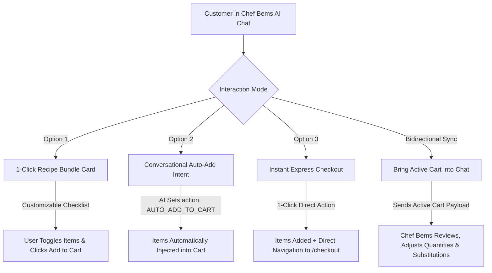

# Bems Farms — Chef Bems AI Automation & Cart Integration Alignment Guide

**Document Version:** 1.0.0  
**Target Audience:** AI Automation Engineer, Full-Stack Engineering Team, Product Lead  
**Scope:** Chef Bems Culinary AI Chatbot, 3 AI Add-to-Cart Options, Bidirectional Cart Sync, and Webhook Contract  

---

## 1. Executive Summary & Objective

This document defines the exact technical interface, operational workflow, and division of responsibilities between the **Full-Stack Application Team** and the **AI Automation Engineer** for the **Chef Bems AI Assistant** on Bems Farms.

### Primary Goal
To empower customers to chat with Chef Bems about Nigerian recipes, meal planning, and dietary goals, and seamlessly convert culinary recommendations into **real farm-fresh grocery orders** with zero friction through **3 Add-To-Cart options** and **bidirectional cart synchronization**.

---

## 2. The 3 AI Add-To-Cart & Cart Sync Options



### Option 1: 1-Click Interactive Recipe Bundle Card
- **Behavior:** When the user asks for a recipe or cooking suggestion (e.g., *"How do I cook Egusi Soup?"*), Chef Bems returns conversational instructions along with a structured `recipeBundle` object.
- **UI Rendering:** The frontend renders an interactive **Recipe Bundle Card** containing:
  - Recipe Title and Serving Count (e.g., *Serves 4*).
  - Itemized checklist with product name, portion size/unit, price in ₦, and checkbox toggles.
  - Subtotal dynamically updated as the user checks/unchecks items.
  - **"🛒 Add All to Cart"** button $\rightarrow$ automatically loads all selected items into `CartContext` and opens the cart drawer.

### Option 2: Conversational Direct Intent Auto-Add
- **Behavior:** When the customer explicitly instructs the AI (e.g., *"Add all these ingredients to my cart"*, *"Add 2 bottles of palm oil and 1 bag of ofada rice"*), the AI Automation agent detects the intent and sets `"action": "AUTO_ADD_TO_CART"` in its response.
- **Frontend Action:** The frontend automatically adds the items to the user's active cart in the background and displays an animated toast: `✨ Chef Bems added X ingredient(s) directly to your active cart!`.

### Option 3: Instant Express Checkout
- **Behavior:** A direct high-converting shortcut on the Recipe Bundle Card: **"⚡ Cook Tonight: Instant Checkout"**.
- **Frontend Action:** Instantly loads the bundle items into the cart and navigates directly to `/checkout` for single-step payment.

### Bidirectional Cart Modification ("Bring Cart Goods Back to Chatbot")
- **Behavior:** Customers who have added items to their cart (either manually or via AI) can click the persistent banner **"🛒 Review / Modify in Chat"** or type *"Review my cart"*.
- **Workflow:**
  1. The frontend packages the active cart (`name`, `quantity`, `unit`, `unit_price`, `subtotal`) and injects it into the prompt.
  2. Chef Bems reviews the cart, identifies missing ingredients (e.g., *"You have beans and palm oil, but you need onions and crayfish for authentic Moi Moi"*), and suggests portion scaling (e.g., scaling from 4 to 10 persons).
  3. The AI returns adjusted items which the user can apply with one click.

---

## 3. Division of Responsibilities

### What the Full-Stack Engineering Team Provides for You (AI Engineer):
1. **Webhook Relay Proxy (`POST /api/ai/chef-chat`):**
   - Handles authentication (only registered users can chat; guests are prompted to sign up).
   - Resolves CORS and forwards payloads reliably to your automation endpoint with a 120-second timeout.
   - Enforces automatic local fallback to Gemini Flash if your webhook is ever unreachable or restarting.
2. **Conversation & Audit Persistence:**
   - Automatically stores all messages in PostgreSQL (`ai_conversations`, `ai_messages`, `ai_audit_logs`).
   - Automatically summarizes past conversation threads and assigns smart thread titles.
3. **Product Catalog Access (`GET /api/products`):**
   - Live endpoint providing real-time store inventory, exact SKU/product names, Naira pricing, unit descriptions, and stock availability.
4. **Interactive Frontend Components:**
   - `RecipeBundleCard` with interactive checkboxes, portion calculator, and 1-click cart triggers.
   - Floating sync banner and drawer auto-opener.

---

### What You (AI Automation Engineer) Need to Provide / Implement:
1. **Webhook Endpoint:**
   - An active webhook URL (e.g., n8n, FastAPI, or Node server) that receives `POST` requests and responds within **5–15 seconds**.
   - Provide the endpoint URL or configure `process.env.N8N_WEBHOOK`.
2. **JSON Response Schema Compliance:**
   - Your webhook MUST return JSON adhering strictly to the response contract detailed in Section 4.
3. **Exact Product Name Matching:**
   - In `relatedProducts` and `recipeBundle.items`, ensure product names match catalog items (e.g., *"Ofada Rice"*, *"Palm Oil"*, *"Brown Beans"*, *"Garri"*, *"Fresh Tomatoes"*).
4. **Intent Detection for Cart Actions:**
   - If the user prompt expresses intent to add items to cart, set `"action": "AUTO_ADD_TO_CART"`.
   - If the user asks to adjust or replace their cart, return the updated item list.

---

## 4. Webhook API Specifications & Contracts

### A. Webhook Request Payload (Sent by Backend to Your Webhook)

**Method:** `POST`  
**Content-Type:** `application/json`

```json
{
  "chatInput": "How do I make authentic Nigerian Party Jollof Rice for 10 people? Please add the ingredients to my cart.",
  "message": "How do I make authentic Nigerian Party Jollof Rice for 10 people? Please add the ingredients to my cart.",
  "sessionId": "user-uuid-12345",
  "userId": "user-uuid-12345",
  "customerEmail": "customer@example.com",
  "conversationHistory": [
    { "role": "user", "content": "Hello Chef Bems!" },
    { "role": "assistant", "content": "Welcome! What delicious meal are we cooking today?" }
  ],
  "cartItems": [
    "Ofada Rice (2 bags)",
    "Palm Oil (1 bottle)"
  ],
  "userPreferences": {
    "dietary": "non-vegetarian",
    "spiceLevel": "medium",
    "familySize": 4
  }
}
```

---

### B. Webhook Response Payload (Your Webhook Returns to Backend)

**Status Code:** `200 OK`  
**Content-Type:** `application/json`

#### Scenario 1: Recipe Guidance with Interactive 1-Click Bundle

```json
{
  "reply": "To make authentic smoky Party Jollof Rice for 10 people, use parboiled long-grain rice, fresh plum tomatoes, tatashe (bell peppers), scotch bonnet (atarodo), and onions. Cook the tomato-pepper base until reduced and fry it thoroughly in vegetable oil before adding rich stock. Cover the pot with foil before the lid to trap steam and achieve that signature smoky party flavor!\n\nHere are the farm-fresh ingredients from Bems Farms you'll need:",
  "relatedProducts": [
    {
      "id": "prod-rice-01",
      "name": "Long Grain Parboiled Rice",
      "price": 8500,
      "unit": "5kg bag",
      "quantity": 2
    },
    {
      "id": "prod-tom-02",
      "name": "Fresh Plum Tomatoes",
      "price": 3200,
      "unit": "1 basket",
      "quantity": 1
    },
    {
      "id": "prod-oil-03",
      "name": "Pure Vegetable Oil",
      "price": 4500,
      "unit": "2L bottle",
      "quantity": 1
    },
    {
      "id": "prod-cray-04",
      "name": "Smoked Crayfish",
      "price": 2500,
      "unit": "200g pack",
      "quantity": 1
    }
  ],
  "recipeBundle": {
    "recipe_name": "Smoky Party Jollof Rice Feast (Serves 10)",
    "servings": 10,
    "items": [
      {
        "id": "prod-rice-01",
        "name": "Long Grain Parboiled Rice",
        "price": 8500,
        "unit": "5kg bag",
        "quantity": 2,
        "checked": true
      },
      {
        "id": "prod-tom-02",
        "name": "Fresh Plum Tomatoes",
        "price": 3200,
        "unit": "1 basket",
        "quantity": 1,
        "checked": true
      },
      {
        "id": "prod-oil-03",
        "name": "Pure Vegetable Oil",
        "price": 4500,
        "unit": "2L bottle",
        "quantity": 1,
        "checked": true
      },
      {
        "id": "prod-cray-04",
        "name": "Smoked Crayfish",
        "price": 2500,
        "unit": "200g pack",
        "quantity": 1,
        "checked": true
      }
    ]
  },
  "action": null
}
```

---

#### Scenario 2: Conversational Direct Intent Auto-Add (`action: "AUTO_ADD_TO_CART"`)

When the user says *"Add all to my cart"*:

```json
{
  "reply": "Done! I have added all 4 ingredients for the Smoky Party Jollof Rice bundle directly to your shopping cart. You can proceed to checkout whenever you are ready!",
  "recipeBundle": {
    "recipe_name": "Smoky Party Jollof Rice Bundle",
    "servings": 10,
    "items": [
      { "id": "prod-rice-01", "name": "Long Grain Parboiled Rice", "price": 8500, "quantity": 2 },
      { "id": "prod-tom-02", "name": "Fresh Plum Tomatoes", "price": 3200, "quantity": 1 },
      { "id": "prod-oil-03", "name": "Pure Vegetable Oil", "price": 4500, "quantity": 1 },
      { "id": "prod-cray-04", "name": "Smoked Crayfish", "price": 2500, "quantity": 1 }
    ]
  },
  "action": "AUTO_ADD_TO_CART"
}
```

---

#### Scenario 3: Active Cart Modification & Review ("Bring Cart to Chat")

When the user asks Chef Bems to review or adjust active cart items:

```json
{
  "reply": "I reviewed your active cart! You currently have Ofada Rice and Palm Oil. To make this into a complete, balanced Nigerian family dinner, you are missing **Smoked Crayfish** for umami depth and **Fresh Tomatoes & Peppers** for the stew base.\n\nHere is your optimized grocery basket:",
  "recipeBundle": {
    "recipe_name": "Chef Bems Complete Dinner Basket",
    "servings": 6,
    "items": [
      { "id": "prod-rice-01", "name": "Ofada Rice", "price": 8000, "unit": "5kg bag", "quantity": 1, "checked": true },
      { "id": "prod-oil-01", "name": "Palm Oil", "price": 3500, "unit": "1L bottle", "quantity": 1, "checked": true },
      { "id": "prod-cray-04", "name": "Smoked Crayfish", "price": 2500, "unit": "200g pack", "quantity": 1, "checked": true },
      { "id": "prod-tom-02", "name": "Fresh Plum Tomatoes", "price": 3200, "unit": "1 basket", "quantity": 1, "checked": true }
    ]
  },
  "action": null
}
```

---

## 5. Field Reference Dictionary

| Field Name | Type | Required | Description |
| :--- | :--- | :--- | :--- |
| `reply` | `string` | **Yes** | Markdown-formatted response containing cooking advice, steps, or culinary commentary. |
| `relatedProducts` | `Array<Product>` | Optional | Array of individual catalog products mentioned in the reply. |
| `recipeBundle` | `Object` | Optional | Structured bundle container for interactive 1-click cart UI. |
| `recipeBundle.recipe_name` | `string` | Optional | Display name of the recipe or meal kit (e.g., *"Smoky Party Jollof Rice Bundle"*). |
| `recipeBundle.servings` | `number` | Optional | Number of people the ingredient quantities cater for. |
| `recipeBundle.items` | `Array<BundleItem>` | Optional | List of items included in the bundle. |
| `items[].id` | `string \| number` | **Yes** | Unique product ID matching Bems Farms database. |
| `items[].name` | `string` | **Yes** | Exact product name from Bems Farms catalog. |
| `items[].price` | `number` | **Yes** | Price in Nigerian Naira (₦). |
| `items[].unit` | `string` | Optional | Measurement unit (e.g., `"5kg bag"`, `"1L bottle"`, `"basket"`). |
| `items[].quantity` | `number` | Optional | Recommended purchase count (defaults to `1`). |
| `action` | `string` | Optional | `"AUTO_ADD_TO_CART"` to trigger automatic cart addition, or `null` for normal conversational flow. |

---

## 6. Prompt Engineering & Persona Guidelines

1. **Persona & Tone:** Warm, knowledgeable, authentically Nigerian, and encouraging. Use local culinary terms naturally (*iru, uziza, efirin, tatashe, rodo, ogbono, egusi, crayfish, scent leaf*).
2. **Catalog Awareness:** Always recommend products sold on Bems Farms (*Rice, Palm Oil, Groundnut Oil, Garri, Beans, Tomatoes, Peppers, Onions, Crayfish, Plantain, Yam, Ugu leaves*).
3. **Safety & Registration Guard:** Non-cooking or non-food topics should be gently redirected back to culinary matters. Unauthenticated visitors are automatically gated by the backend.
4. **Portion Scaling:** When asked to adjust for a specific party size (e.g., 20 people vs 4 people), scale quantities proportionally in the `recipeBundle.items` list.

---

## 7. Testing & Integration Verification Checklist

- [x] **Backend Relay Ready:** `POST /api/ai/chef-chat` active and forwards to webhook with 120s timeout.
- [x] **Local Fallback Ready:** Gemini Flash fallback ensures 100% uptime if webhook times out.
- [x] **Option 1 UI Tested:** `RecipeBundleCard` tested with dynamic subtotal and 1-click add.
- [x] **Option 2 UI Tested:** `AUTO_ADD_TO_CART` action automatically updates user cart and shows toast.
- [x] **Option 3 UI Tested:** `Instant Checkout` routes selected items directly to `/checkout`.
- [x] **Bidirectional Sync Tested:** Active cart details sent with prompts and displayed with top review chip.
