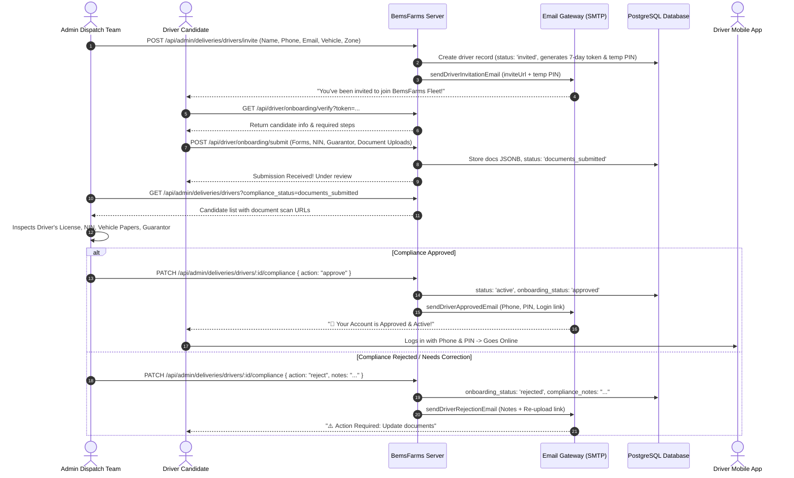

# Bems Farms — Driver Registration, Compliance & Logistics API Documentation

**Version:** 2.0  
**Target Audience:** Mobile Engineers, Frontend Engineers, Backend Developers, Operations & Compliance Team  
**Base URL (Production):** `https://api.bemsfarms.com`  
**Base URL (Local/Staging):** `http://localhost:5000`  
**Authentication Standard:** JSON Web Token (JWT) via `Authorization: Bearer <token>`  
**Response Content-Type:** `application/json`

---

## 1. System Overview & Architecture

Bems Farms provides a multi-stage **Driver Onboarding, Compliance Verification, and Dispatch Routing Pipeline**.

The system ensures that every driver operating in the fleet is identity-verified, holds valid national and transport documentation, has registered guarantor information, and is approved by the Bems Farms Compliance Team prior to receiving live dispatches.



---

## 2. Driver Onboarding States & Status Enum

| `onboarding_status` | Operational Status (`status`) | Description |
| :--- | :--- | :--- |
| `invited` | `pending` | Invitation sent via email. Awaiting candidate to open link and fill forms. |
| `documents_submitted` | `pending` | Candidate completed forms and uploaded all compliance scans. Ready for Admin Review. |
| `approved` | `active` | Admin reviewed and approved all documents. Driver can log into the Driver App. |
| `rejected` | `suspended` | Document issue or rejection. Driver notified with notes to re-upload. |

---

## 3. Database Schema Reference (`drivers` Table)

| Field Name | Type | Description |
| :--- | :--- | :--- |
| `id` | `SERIAL PRIMARY KEY` | Unique driver ID. |
| `name` | `VARCHAR(255)` | Full legal name. |
| `phone` | `VARCHAR(50) UNIQUE` | Login phone number (format: `08012345678` or `+234...`). |
| `email` | `VARCHAR(255) UNIQUE` | Contact email address for invitations and notifications. |
| `password` | `VARCHAR(255)` | Bcrypt-hashed password / 6-digit PIN. |
| `vehicle_type` | `VARCHAR(50)` | `motorcycle`, `bicycle`, `car`, `van`, `truck`. |
| `vehicle_plate` | `VARCHAR(50)` | Official vehicle registration plate number. |
| `license_number` | `VARCHAR(100)` | National Driver's License ID number. |
| `nin_number` | `VARCHAR(50)` | 11-digit National Identification Number (NIN). |
| `address` | `TEXT` | Residential address of driver. |
| `emergency_contact_name` | `VARCHAR(255)` | Next of kin full name. |
| `emergency_contact_phone` | `VARCHAR(50)` | Next of kin contact number. |
| `emergency_contact_relationship` | `VARCHAR(100)` | Relationship (e.g., Spouse, Sibling, Parent). |
| `guarantor_name` | `VARCHAR(255)` | Guarantor full legal name. |
| `guarantor_phone` | `VARCHAR(50)` | Guarantor phone number. |
| `guarantor_address` | `TEXT` | Guarantor residence / office address. |
| `documents` | `JSONB` | Object with document URLs: `{ drivers_license, nin_slip, vehicle_registration, passport_photo, guarantor_form }`. |
| `onboarding_status` | `VARCHAR(50)` | `invited` \| `documents_submitted` \| `approved` \| `rejected`. |
| `compliance_notes` | `TEXT` | Internal admin notes or rejection feedback to the candidate. |
| `compliance_reviewed_at` | `TIMESTAMP` | Timestamp when admin completed compliance decision. |
| `compliance_reviewed_by` | `INTEGER` | Admin user ID who conducted compliance review. |
| `invite_token` | `VARCHAR(255)` | Secure crypto-random token for the onboarding URL. |
| `invite_expires_at` | `TIMESTAMP` | Expiry timestamp (7 days from invitation creation). |
| `zone_id` | `INTEGER` | Primary delivery coverage zone ID. |
| `commission_per_delivery` | `NUMERIC(10,2)` | Commission credited per completed delivery (default ₦500.00). |
| `status` | `VARCHAR(50)` | `active`, `suspended`, `inactive`, `pending`. |
| `is_available` | `BOOLEAN` | Shift status (Online/Offline). |
| `is_on_delivery` | `BOOLEAN` | `true` if currently in transit with an active order. |
| `current_lat` | `DOUBLE PRECISION` | Real-time GPS latitude. |
| `current_lng` | `DOUBLE PRECISION` | Real-time GPS longitude. |

---

## 4. Admin Dispatch Management APIs

### 4.1 Send Driver Onboarding Invitation
* **Method:** `POST`
* **Path:** `/api/admin/deliveries/drivers/invite`
* **Auth:** Required (Admin / Super Admin / Logistics Manager)
* **Description:** Creates candidate driver record, creates a 7-day token, and sends branded onboarding invitation email.

#### Request Body
```json
{
  "name": "Sunday Nwosu",
  "email": "sunday.nwosu@bemsfarms.com",
  "phone": "08078901234",
  "vehicle_type": "motorcycle",
  "zone_id": 1,
  "commission_per_delivery": 500,
  "password": "PIN" // Optional. If omitted, a random 6-digit PIN is auto-generated
}
```

#### Success Response (`201 Created`)
```json
{
  "message": "Driver invitation sent successfully to sunday.nwosu@bemsfarms.com",
  "driver": {
    "id": 12,
    "name": "Sunday Nwosu",
    "email": "sunday.nwosu@bemsfarms.com",
    "phone": "08078901234",
    "vehicle_type": "motorcycle",
    "onboarding_status": "invited",
    "invite_expires_at": "2026-09-27T15:00:00.000Z"
  },
  "inviteUrl": "https://bemsfarms.com/driver/onboarding?token=a83f98c2...",
  "temporaryPin": "893412"
}
```

---

### 4.2 Conduct Compliance Review (Approve / Reject)
* **Method:** `PATCH`
* **Path:** `/api/admin/deliveries/drivers/:id/compliance`
* **Auth:** Required (Admin / Logistics Manager)
* **Description:** Approves or rejects submitted compliance documents. Triggers automated email notification to the driver.

#### Request Body — Approve:
```json
{
  "action": "approve",
  "notes": "All identity, NIN, and vehicle documents verified clean."
}
```

#### Request Body — Reject (Request Correction):
```json
{
  "action": "reject",
  "notes": "Vehicle insurance slip is expired. Please re-upload current 2026 vehicle papers."
}
```

#### Success Response (`200 OK`)
```json
{
  "message": "Driver compliance approved and account activated successfully.",
  "driver": {
    "id": 12,
    "name": "Sunday Nwosu",
    "phone": "08078901234",
    "email": "sunday.nwosu@bemsfarms.com",
    "status": "active",
    "onboarding_status": "approved",
    "compliance_reviewed_at": "2026-09-20T16:15:00.000Z",
    "compliance_notes": "All identity, NIN, and vehicle documents verified clean."
  }
}
```

---

### 4.3 Resend Driver Invitation Email
* **Method:** `POST`
* **Path:** `/api/admin/deliveries/drivers/:id/resend-invite`
* **Auth:** Required (Admin)

#### Success Response (`200 OK`)
```json
{
  "message": "Invitation email resent successfully to sunday.nwosu@bemsfarms.com",
  "inviteUrl": "https://bemsfarms.com/driver/onboarding?token=...",
  "invite_expires_at": "2026-09-27T16:15:00.000Z"
}
```

---

### 4.4 List Fleet Drivers with Compliance Filter
* **Method:** `GET`
* **Path:** `/api/admin/deliveries/drivers`
* **Auth:** Required (Admin)
* **Query Parameters:**
  - `compliance_status` (optional): `invited`, `documents_submitted`, `approved`, `rejected`
  - `status` (optional): `active`, `suspended`, `pending`
  - `zone_id` (optional): `1`
  - `search` (optional): search by name, phone, or email

#### Success Response (`200 OK`)
```json
{
  "drivers": [
    {
      "id": 12,
      "name": "Sunday Nwosu",
      "phone": "08078901234",
      "email": "sunday.nwosu@bemsfarms.com",
      "vehicle_type": "motorcycle",
      "vehicle_plate": "ABA-492-XA",
      "nin_number": "12984920194",
      "address": "14 Market Road, Aba, Abia State",
      "emergency_contact_name": "Ngozi Nwosu",
      "emergency_contact_phone": "08033221100",
      "emergency_contact_relationship": "Spouse",
      "guarantor_name": "Chief Emeka Okafor",
      "guarantor_phone": "08099887766",
      "guarantor_address": "8 Factory Road, Aba",
      "documents": {
        "drivers_license": "https://api.bemsfarms.com/uploads/drivers/license_12.jpg",
        "nin_slip": "https://api.bemsfarms.com/uploads/drivers/nin_12.jpg",
        "vehicle_registration": "https://api.bemsfarms.com/uploads/drivers/reg_12.jpg",
        "passport_photo": "https://api.bemsfarms.com/uploads/drivers/passport_12.jpg",
        "guarantor_form": "https://api.bemsfarms.com/uploads/drivers/guarantor_12.jpg"
      },
      "onboarding_status": "documents_submitted",
      "compliance_notes": null,
      "status": "pending",
      "rating": 5.0,
      "total_deliveries": 0,
      "zone_name": "Aba Central Hub"
    }
  ],
  "counts": {
    "total": 5,
    "pending_compliance": 1,
    "active": 4,
    "invited": 0,
    "rejected": 0
  }
}
```

---

## 5. Driver Self-Service Onboarding APIs

### 5.1 Verify Invitation Token
* **Method:** `GET`
* **Path:** `/api/driver/onboarding/verify`
* **Auth:** Public (Token required in query)
* **Query Parameters:** `token=<INVITE_TOKEN>`

#### Success Response (`200 OK`)
```json
{
  "valid": true,
  "driver": {
    "id": 12,
    "name": "Sunday Nwosu",
    "email": "sunday.nwosu@bemsfarms.com",
    "phone": "08078901234",
    "vehicle_type": "motorcycle",
    "vehicle_plate": "",
    "nin_number": "",
    "address": "",
    "emergency_contact_name": "",
    "emergency_contact_phone": "",
    "emergency_contact_relationship": "",
    "guarantor_name": "",
    "guarantor_phone": "",
    "guarantor_address": "",
    "bank_name": "",
    "account_number": "",
    "account_name": "",
    "onboarding_status": "invited",
    "compliance_notes": null,
    "documents": {}
  }
}
```

---

### 5.2 Upload Compliance Document Scan
* **Method:** `POST`
* **Path:** `/api/driver/upload` (or `/api/upload`)
* **Auth:** Public / Onboarding Token
* **Content-Type:** `multipart/form-data`
* **Body:** `file: <Binary File>` (JPEG, PNG, WebP, PDF — max 10MB)

#### Success Response (`200 OK`)
```json
{
  "url": "https://api.bemsfarms.com/uploads/driver_docs/doc_1726849201.jpg",
  "filename": "doc_1726849201.jpg",
  "size": 1849204
}
```

---

### 5.3 Submit Completed Onboarding Dossier
* **Method:** `POST`
* **Path:** `/api/driver/onboarding/submit`
* **Auth:** Public (Token in body or header)
* **Content-Type:** `application/json`

#### Request Body
```json
{
  "token": "a83f98c2d1490234...",
  "name": "Sunday Nwosu",
  "phone": "08078901234",
  "email": "sunday.nwosu@bemsfarms.com",
  "nin_number": "12984920194",
  "address": "14 Market Road, Aba, Abia State",
  "emergency_contact_name": "Ngozi Nwosu",
  "emergency_contact_phone": "08033221100",
  "emergency_contact_relationship": "Spouse",
  "guarantor_name": "Chief Emeka Okafor",
  "guarantor_phone": "08099887766",
  "guarantor_address": "8 Factory Road, Aba",
  "vehicle_type": "motorcycle",
  "vehicle_plate": "ABA-492-XA",
  "license_number": "DL-90821-NG",
  "bank_name": "Access Bank",
  "account_number": "0123456789",
  "account_name": "Sunday Nwosu",
  "password": "PIN", // Optional new PIN setup
  "documents": {
    "drivers_license": "https://api.bemsfarms.com/uploads/driver_docs/license.jpg",
    "nin_slip": "https://api.bemsfarms.com/uploads/driver_docs/nin.jpg",
    "vehicle_registration": "https://api.bemsfarms.com/uploads/driver_docs/vehicle_reg.jpg",
    "passport_photo": "https://api.bemsfarms.com/uploads/driver_docs/passport.jpg",
    "guarantor_form": "https://api.bemsfarms.com/uploads/driver_docs/guarantor.jpg"
  }
}
```

#### Success Response (`200 OK`)
```json
{
  "message": "Onboarding information and compliance documents submitted successfully. Our team will review your application.",
  "driver": {
    "id": 12,
    "name": "Sunday Nwosu",
    "onboarding_status": "documents_submitted",
    "status": "pending"
  }
}
```

---

## 6. Mobile Driver App Operational APIs

### 6.1 Driver Login
* **Method:** `POST`
* **Path:** `/api/driver/auth/login`
* **Auth:** None

#### Request Body
```json
{
  "phone": "08078901234",
  "password": "PIN"
}
```

#### Success Response (`200 OK`)
```json
{
  "token": "eyJhbGciOiJIUzI1NiIsInR5cCI6IkpXVCJ9...",
  "driver": {
    "id": 12,
    "name": "Sunday Nwosu",
    "phone": "08078901234",
    "email": "sunday.nwosu@bemsfarms.com",
    "status": "active",
    "onboarding_status": "approved",
    "vehicle_type": "motorcycle",
    "vehicle_plate": "ABA-492-XA",
    "is_available": true,
    "is_on_delivery": false
  }
}
```

*Note: If `onboarding_status` is not `approved` or `status` is `pending`/`suspended`, the API returns `403 Forbidden` with an informative error message explaining that compliance review is pending.*

---

### 6.2 Stream Real-Time GPS Location
* **Method:** `POST`
* **Path:** `/api/driver/location`
* **Auth:** Required (`Bearer <token>`)

#### Request Body
```json
{
  "latitude": 5.106584,
  "longitude": 7.368302,
  "heading": 182.4,
  "speed": 28.5
}
```

#### Success Response (`200 OK`)
```json
{
  "success": true,
  "recorded_at": "2026-09-20T16:20:00.000Z"
}
```

---

### 6.3 Update Shift Availability (Go Online / Offline)
* **Method:** `PATCH`
* **Path:** `/api/driver/auth/availability`
* **Auth:** Required (`Bearer <token>`)

#### Request Body
```json
{
  "is_available": true
}
```

#### Success Response (`200 OK`)
```json
{
  "message": "Availability status updated",
  "is_available": true
}
```

---

### 6.4 Fetch Available Delivery Dispatches
* **Method:** `GET`
* **Path:** `/api/driver/deliveries/available`
* **Auth:** Required (`Bearer <token>`)

#### Success Response (`200 OK`)
```json
{
  "deliveries": [
    {
      "id": 1042,
      "order_number": "BF-2026-0920-891",
      "customer_name": "Chidinma Eze",
      "customer_phone": "08055443322",
      "delivery_address": "Plot 12, Brass Street, Aba",
      "delivery_lat": 5.1123,
      "delivery_lng": 7.3712,
      "distance_km": 2.4,
      "estimated_duration_mins": 12,
      "order_total": 18500.00,
      "driver_commission": 500.00,
      "items_count": 4,
      "special_instructions": "Call when at the security gate."
    }
  ]
}
```

---

### 6.5 Accept Dispatch & Update Milestone Status
* **Accept:** `POST /api/driver/deliveries/:id/accept`
* **Update Status:** `PATCH /api/driver/deliveries/:id/status`

#### Status Milestone Values:
1. `assigned`
2. `awaiting_pickup`
3. `en_route`
4. `arrived`
5. `delivered` (requires delivery confirmation code / recipient signature)
6. `delivery_attempted`

#### Request Body (`PATCH /api/driver/deliveries/:id/status`):
```json
{
  "status": "delivered",
  "delivery_pin": "8412",
  "notes": "Package handed directly to customer."
}
```

---

## 7. Email Notifications Overview

| Email Template | Trigger Event | Key Elements & Action |
| :--- | :--- | :--- |
| **`sendDriverInvitationEmail`** | Admin clicks "Send Onboarding Invite" | • 7-day secure link to `/driver/onboarding?token=...`<br>• Temporary Driver PIN<br>• Vehicle type & zone notice |
| **`sendDriverApprovedEmail`** | Admin clicks "Approve Compliance" | • Account activated announcement<br>• Driver Phone & App PIN<br>• Direct button to launch Driver App |
| **`sendDriverRejectionEmail`** | Admin clicks "Request Correction" | • Rejection / Correction reason notes<br>• 1-Click Re-upload button to fix documents |

---

## 8. Summary of Error Codes

| Status Code | Meaning | Example Cause |
| :--- | :--- | :--- |
| `400 Bad Request` | Missing required fields | Missing NIN, Phone, or Document scan URLs. |
| `401 Unauthorized` | Invalid or missing token | Expired JWT or missing Bearer header. |
| `403 Forbidden` | Compliance pending or rejected | Driver attempting to log into mobile app before admin approval. |
| `404 Not Found` | Resource not found | Driver ID or Delivery order not found. |
| `410 Gone` | Token expired | Driver opened an invitation link older than 7 days. |

---

*© 2026 Bems Farms Logistics & Operations Engineering.*
