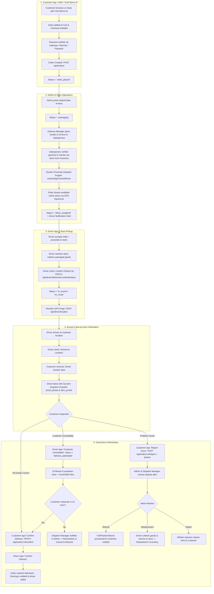

# Bems Farms — End-to-End Order & Delivery Architecture Workflow

This document provides a comprehensive, step-by-step technical and operational blueprint of the **Order Lifecycle, Packaging, Proximity Dispatching, Delivery Fulfillment, Customer Confirmation, and Issue Resolution Flows** across the **Customer App/Web**, **Admin/Operations Portal**, and **Driver App**.

---

## 1. System Topology & Architecture



---

## 2. Granular Step-by-Step Lifecycle

### Phase 1: Order Placement & Payment
1. **Customer Order Initiation**:
   - Customer shops via the **Customer Web Storefront**, **Mobile App**, or **Chef Bems AI Assistant**.
   - Chef Bems AI calculates ingredient portions directly against the live PostgreSQL `products` inventory.
2. **Payment Processing**:
   - Customer initiates checkout (`POST /api/payments/initialize` or Monnify/Paystack widget).
   - Once payment is verified, the order record is committed (`POST /api/orders/`).
   - Order initial state:
     - `orders.status` = `'order_placed'` (or `'confirmed'`)
     - `orders.tracking_status` = `'order_placed'`

---

### Phase 2: Store Processing & Warehouse Checkout
1. **Invoice Generation & Packaging Trigger**:
   - The Store Admin or Kitchen Staff opens the order in the Admin Portal and prints the **Sales / Packing Invoice**.
   - Order status transitions to **Packaging** (`'packaging'` / `'packed_ready'`).
2. **Salesperson Verification & Inventory Checkout**:
   - The Delivery Manager hands the printed invoice and physical goods to the Salesperson.
   - The Salesperson verifies payment clearance and checks the items out of the system, deducting from warehouse inventory/batches.
3. **Proximity Auto-Dispatching**:
   - Once packaging is verified, the backend proximity dispatch engine (`autoAssignClosestDriver`) activates.
   - The algorithm:
     - Identifies all active drivers with `driver_availability.is_available = true` and `is_on_delivery = false`.
     - Calculates the geodesic distance (Haversine formula) between the store location (`lat: 5.1065, lng: 7.3667`) and each driver's latest coordinates in `driver_locations`.
     - Selects the closest available driver and inserts a `delivery_assignments` record.
     - Sets `orders.status` = `'driver_assigned'`, `deliveries.status` = `'assigned'`.
     - Sends a high-priority push notification to the driver's device via `driver_notifications`.

---

### Phase 3: Driver Store Pickup & Transit
1. **Store Pickup**:
   - The mapped driver receives the pickup notification with the store address and order items.
   - Upon arriving at the store, the driver collects the packaged goods and clicks **"Confirm Picked Up"** (`PATCH /api/driver/deliveries/{orderId}/status` with `status: 'en_route'`).
2. **In Transit**:
   - System updates `orders.status` = `'shipped'`, `orders.tracking_status` = `'out_for_delivery'`.
   - `driver_availability.is_on_delivery` is set to `true`.
   - Driver's mobile device periodically reports GPS coordinates (`POST /api/driver/location`), powering real-time tracking on the customer's map (`GET /api/orders/track/:code`).

---

### Phase 4: Arrival & Item-by-Item Photo Capture
1. **Doorstep Arrival**:
   - The driver arrives at the customer's delivery destination and taps **"Arrived at Location"** (`status: 'arrived'`).
   - `deliveries.arrived_at` is stamped, and `orders.tracking_status` transitions to `'driver_arrived'`.
   - The customer receives an instant in-app notification to meet the driver.
2. **Item-by-Item Delivery Snapshots**:
   - The driver asks the customer to inspect the goods.
   - The driver captures a photo snapshot for each item/package using the Driver App camera.
   - Photos are uploaded and attached as `proof_photos` (array of URLs) and `item_proofs` (`[{ item_id, product_name, photo_url, verified: true }]`).

---

### Phase 5: Inspection & Outcomes

#### Scenario A: Successful Delivery
1. Customer inspects and confirms all goods are in order.
2. Customer presses **"Confirm Delivery"** in the Customer App (`PATCH /api/orders/{id}/confirm`).
3. Driver confirmation button unlocks on the Driver App.
4. Driver clicks **"Complete Delivery"** (`PATCH /api/driver/deliveries/{orderId}/status` with `status: 'delivered'`).
5. Order state:
   - `orders.status` = `'delivered'`
   - `orders.tracking_status` = `'delivered'`
   - `deliveries.delivered_at` = `NOW()`
   - Driver commission (e.g. ₦500 – ₦1,000 per delivery) is credited to `drivers.total_earnings` and recorded in `driver_commissions`.
   - Driver status reverts to `is_on_delivery = false`, ready for the next order.

#### Scenario B: Customer Unavailable
1. Driver arrives but customer is not answering door or calls.
2. Driver taps **"Customer Unavailable"** on the Driver App (`status: 'delivery_attempted'`).
3. System triggers SMS and Push notifications to customer + starts a **15-minute countdown**.
4. If customer responds within 15 minutes $\rightarrow$ Delivery proceeds normally.
5. If the timer expires:
   - Delivery attempt count increments (`attempts = attempts + 1`, max 2).
   - Dispatch Manager receives an alert in Admin Portal.
   - Admin options:
     - **Reschedule Attempt**: Driver attempts again later.
     - **Cancel & Return**: Driver returns goods to store $\rightarrow$ Admin checks items back into inventory $\rightarrow$ Refund processed.

#### Scenario C: Issue Reported (Damage / Missing Item / Wrong Quantity)
1. Customer identifies an issue during physical inspection.
2. Customer taps **"Report Issue"** (`POST /api/orders/{id}/report`).
3. Customer selects the reason (wrong item, damaged goods, missing item, wrong quantity) and attaches optional photos.
4. Order tracking status becomes `'issue_reported'`, and a high-priority ticket is created in `issues`.
5. Admin/Dispatch Manager reviews the case in the Admin Portal:
   - **Full or Partial Refund**: Refund processed to customer's bank/wallet.
   - **Replacement Dispatched**: Driver collects defective item, returns to store, and a replacement batch is packed.
   - **Claim Rejected**: Written explanation sent to customer if dispute is invalid.

---

## 3. Complete API Endpoints Matrix

### Customer App APIs (`/api/*`)
| Method | Endpoint | Description |
|---|---|---|
| `POST` | `/api/auth/social` | Social sign-in (Google & Apple) for mobile app |
| `POST` | `/api/payments/initialize` | Initialize payment & receive checkout reference/URL |
| `GET` | `/api/orders` | List logged-in customer's order history |
| `GET` | `/api/orders/:id` | Get details and item breakdown of a specific order |
| `POST` | `/api/orders` | Place a new customer order |
| `PATCH` | `/api/orders/:id/confirm` | Customer confirms delivery upon goods inspection |
| `POST` | `/api/orders/:id/report` | Report delivery issue with reasons & photos |
| `GET` | `/api/orders/track/:code` | Public approximate GPS live tracking |

### Driver App APIs (`/api/driver/*`)
| Method | Endpoint | Description |
|---|---|---|
| `POST` | `/api/driver/auth/login` | Driver login with phone/email and password |
| `GET` | `/api/driver/auth/me` | Logged-in driver profile & vehicle info |
| `PATCH` | `/api/driver/auth/profile` | Update driver contact & avatar photo |
| `PATCH` | `/api/driver/availability` | Toggle online/offline status (`is_available`) |
| `GET` | `/api/driver/deliveries` | List active mapped deliveries for driver |
| `GET` | `/api/driver/deliveries/history` | List completed past delivery history |
| `GET` | `/api/driver/deliveries/:orderId` | View full details of an assigned delivery |
| `PATCH` | `/api/driver/deliveries/:orderId/status`| Update status (`accepted`, `en_route`, `arrived`, `delivered`, `failed`) + per-item proof photos |
| `POST` | `/api/driver/location` | Ping GPS coordinates (`lat`, `lng`, `heading`, `speed`) |
| `GET` | `/api/driver/earnings` | View wallet balance, commissions, and payout history |
| `POST` | `/api/driver/withdraw` | Request withdrawal of earnings to bank account |

### Admin & Dispatch APIs (`/api/admin/*`)
| Method | Endpoint | Description |
|---|---|---|
| `POST` | `/api/admin/deliveries/drivers` | Create driver account & credentials |
| `PUT` | `/api/admin/deliveries/drivers/:id/credentials` | Reset driver login credentials |
| `POST` | `/api/orders/:id/auto-assign-driver` | Trigger proximity driver auto-mapping |
| `GET` | `/api/admin/deliveries/payouts` | List driver withdrawal requests |
| `PATCH` | `/api/admin/deliveries/payouts/:id` | Approve, pay, or reject driver withdrawal |
| `GET` | `/api/admin/deliveries/active` | Live dispatch monitoring dashboard |
| `GET` | `/api/issues` | Review customer-reported delivery issues |

---

## 4. Database Schema Structure Reference

```sql
-- 1. Deliveries table with multi-photo proof and milestone tracking
CREATE TABLE deliveries (
    id BIGSERIAL PRIMARY KEY,
    delivery_ref VARCHAR(30) NOT NULL UNIQUE,
    order_id VARCHAR(30) NOT NULL REFERENCES orders(id),
    driver_id BIGINT REFERENCES drivers(id),
    zone_id VARCHAR(50),
    delivery_address TEXT,
    status VARCHAR(30) DEFAULT 'assigned', -- assigned, awaiting_pickup, en_route, arrived, delivery_attempted, delivered, cancelled
    assigned_at TIMESTAMP,
    accepted_at TIMESTAMP,
    dispatched_at TIMESTAMP,
    arrived_at TIMESTAMP,
    delivered_at TIMESTAMP,
    proof_photo TEXT,
    proof_photos JSONB DEFAULT '[]'::jsonb,
    item_proofs JSONB DEFAULT '[]'::jsonb,
    proof_note TEXT,
    failure_reason TEXT,
    attempts SMALLINT DEFAULT 0,
    eta_minutes INTEGER,
    created_at TIMESTAMP DEFAULT NOW(),
    updated_at TIMESTAMP DEFAULT NOW()
);

-- 2. Drivers and Availability
CREATE TABLE drivers (
    id BIGSERIAL PRIMARY KEY,
    name VARCHAR(100) NOT NULL,
    email VARCHAR(150),
    phone VARCHAR(20) NOT NULL,
    avatar_url TEXT,
    vehicle_type VARCHAR(20),
    vehicle_plate VARCHAR(20),
    primary_zone_id VARCHAR(50),
    rating NUMERIC(3,1) DEFAULT 5.0,
    total_deliveries INTEGER DEFAULT 0,
    total_earnings NUMERIC(12,2) DEFAULT 0,
    commission_per_delivery NUMERIC(10,2) DEFAULT 500.00,
    status VARCHAR(20) DEFAULT 'active', -- active, on_delivery, off_duty, suspended
    is_available BOOLEAN DEFAULT TRUE,
    bank_name VARCHAR(100),
    account_number VARCHAR(30),
    account_name VARCHAR(100),
    created_at TIMESTAMP DEFAULT NOW()
);

CREATE TABLE driver_availability (
    id BIGSERIAL PRIMARY KEY,
    driver_id BIGINT NOT NULL UNIQUE REFERENCES drivers(id) ON DELETE CASCADE,
    is_available BOOLEAN DEFAULT FALSE,
    is_on_delivery BOOLEAN DEFAULT FALSE,
    last_toggled_at TIMESTAMP DEFAULT NOW()
);

-- 3. Driver GPS Location Breadcrumbs
CREATE TABLE driver_locations (
    id BIGSERIAL PRIMARY KEY,
    driver_id BIGINT NOT NULL REFERENCES drivers(id) ON DELETE CASCADE,
    latitude NUMERIC(10,7) NOT NULL,
    longitude NUMERIC(10,7) NOT NULL,
    heading NUMERIC(5,2),
    speed NUMERIC(6,2),
    accuracy NUMERIC(6,2),
    recorded_at TIMESTAMP DEFAULT NOW()
);

-- 4. Driver Payout / Withdrawal Requests
CREATE TABLE driver_payouts (
    id BIGSERIAL PRIMARY KEY,
    driver_id BIGINT NOT NULL REFERENCES drivers(id) ON DELETE CASCADE,
    payout_ref VARCHAR(50) UNIQUE NOT NULL,
    amount NUMERIC(12,2) NOT NULL,
    bank_name VARCHAR(100),
    account_number VARCHAR(30),
    account_name VARCHAR(100),
    status VARCHAR(30) DEFAULT 'pending', -- pending, approved, paid, rejected
    requested_at TIMESTAMP DEFAULT NOW(),
    processed_at TIMESTAMP,
    processed_by INTEGER,
    rejection_reason TEXT,
    notes TEXT
);
```
